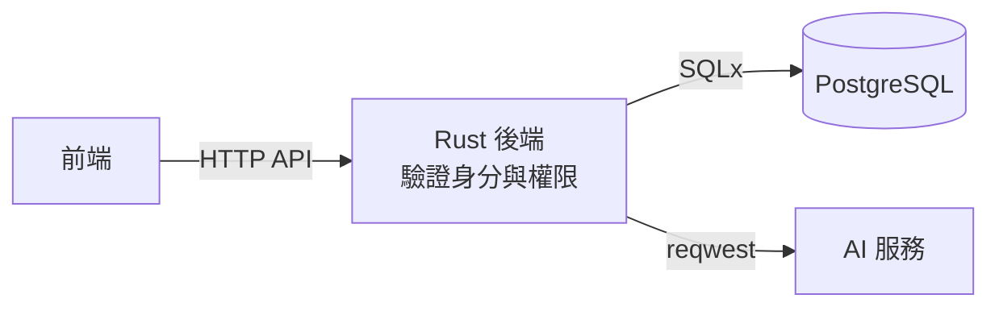

# socrates-chat

蘇格拉底式對話學習系統：學生就哲學題目與 AI 進行多輪討論。系統以追問引導學生釐清立場、檢視理由與假設，而不直接代答；教師可建立討論活動並查看學生的學習成果。系統只服務一門課程，使用資格由修課名單控制。

> **目前狀態：規格階段。** 功能需求已拆成規格（S-xx）與功能（F-xx）Issues，未定案的產品與技術決策都先由規格 Issue 處理。已確認的決策見 [`docs/specs/decisions.md`](docs/specs/decisions.md)。

## 技術棧

| 範圍 | 狀態 | 內容 |
| --- | --- | --- |
| 後端 | 已確定 | Rust、Axum、Tokio、SQLx、Serde、reqwest、tracing |
| 資料庫 | 已確定 | PostgreSQL；開發與 CI 用 Docker Compose，正式環境部署待 S-09 |
| 前端 | **待確認（S-11）** | 候選：React、TypeScript、Vite、Tailwind CSS、assistant-ui、Recharts |
| AI 服務 | 已確定（S-03.1） | OpenAI API（後端以單一介面包裝，模型待評估） |
| 登入 | 已確定（S-01.1） | 只接受 Google；Rust 自行整合 OAuth，session 存 PostgreSQL |
| 對話傳輸 | 已確定（S-08.4） | HTTP + SSE 串流 |

各套件版本與正式環境部署方式尚未指定。Supabase 與 Redis 不在目前架構內。

### 資料流



前端只呼叫 Rust 後端，不直接存取資料庫或 AI 服務，也不持有資料庫憑證或 AI 服務金鑰。

## 專案結構

```text
.
├── backend/     # Rust + Axum API 服務
├── frontend/    # 前端（技術選型待 S-11，目前為佔位）
├── .github/     # CI 與 commitlint workflows
├── AGENTS.md    # 給 AI coding agent 的開發指引
└── CONTRIBUTING.md
```

## 快速開始

### 後端

需求：Rust stable（由 `backend/rust-toolchain.toml` 指定，rustup 會自動安裝對應元件）。

```bash
cd backend
cargo run          # 啟動於 http://127.0.0.1:3000
curl http://127.0.0.1:3000/health   # {"status":"ok"}
cargo test         # 執行測試
```

### 前端

尚未建立，請見 [`frontend/README.md`](frontend/README.md)。

## 參與開發

請先閱讀 [CONTRIBUTING.md](CONTRIBUTING.md)。重點如下：

- 開發主線為 `main`，**禁止直接 push 到 `main`**，所有改動經由 Pull Request 合併。
- 所有 commit 遵守 [Conventional Commits](https://www.conventionalcommits.org/)，CI 會以 commitlint 檢查。
- 採 SDD + TDD：先確認規格與驗收情境，再寫會失敗的測試，最後做最小實作。

使用 AI coding agent 的開發者，請讓 agent 讀取 [AGENTS.md](AGENTS.md)。
