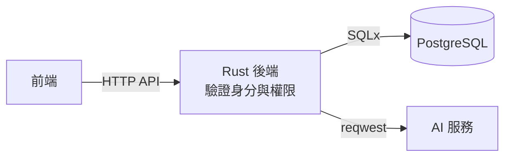

# socrates-chat

蘇格拉底式對話學習系統：學生就哲學題目與 AI 進行多輪討論。系統以追問引導學生釐清立場、檢視理由與假設，而不直接代答；教師可建立討論活動並查看學生的學習成果。系統只服務一門課程，使用資格由修課名單控制。

> **目前狀態：規格階段。** 功能需求已拆成規格（S-xx）與功能（F-xx）Issues，未定案的產品與技術決策都先由規格 Issue 處理。已確認的決策見 [`docs/specs/decisions.md`](docs/specs/decisions.md)。

## 技術棧

| 範圍 | 狀態 | 內容 |
| --- | --- | --- |
| 後端 | 已確定 | Rust、Axum、Tokio、SQLx、Serde、reqwest、tracing |
| 資料庫 | 已確定 | PostgreSQL；開發與 CI 用 Docker Compose，正式環境部署待 S-09 |
| 前端 | **暫定（S-11 尚未正式定案，隨時可改）** | React、TypeScript、Vite、Tailwind CSS、shadcn/ui、assistant-ui |
| AI 服務 | 已確定（S-03.1） | OpenAI API（後端以單一介面包裝，模型待評估） |
| 登入 | 已確定（S-01.1） | 內建電子郵件＋密碼（不開放註冊）加 Google 登入；Rust 自行實作，session 存 PostgreSQL |
| 對話傳輸 | 已確定（S-08.4） | HTTP + SSE 串流 |

各套件版本與正式環境部署方式尚未指定。Supabase 與 Redis 不在目前架構內。

### 資料流



前端只呼叫 Rust 後端，不直接存取資料庫或 AI 服務，也不持有資料庫憑證或 AI 服務金鑰。

## 專案結構

```text
.
├── backend/     # Rust + Axum API 服務
├── frontend/    # 前端（暫定技術選型，見 frontend/README.md）
├── .github/     # CI 與 commitlint workflows
├── AGENTS.md    # 給 AI coding agent 的開發指引
├── CONTRIBUTING.md
└── LICENSE      # MIT
```

## 快速開始

```bash
git clone https://github.com/2026software-3/socrates-chat.git
cd socrates-chat
cp .env.example .env    # 填入 GOOGLE_CLIENT_ID、GOOGLE_CLIENT_SECRET、ADMIN_EMAILS、OPENAI_API_KEY、OPENAI_MODEL
```

### 本地執行（需要 Rust、Node.js、Docker）

```bash
# 終端機 1：資料庫＋後端（http://127.0.0.1:3000）
docker compose up -d db
set -a && . ./.env && set +a
cd backend && cargo run
```

```bash
# 終端機 2：前端（http://localhost:5173）
cd frontend
npm ci
npm run dev
```

### Docker（只需要 Docker）

```bash
docker compose --profile app up --build    # http://localhost:3000
```

兩種跑法都使用 3000 埠，同一時間只能跑其中一種。

### 正式環境

正式環境的部署方式尚未決定（S-09）。migration 須在部署前單獨執行、不要依賴 `RUN_MIGRATIONS`，並保持 `COOKIE_SECURE=true`；維運流程見 [`docs/specs/S-09.3-ops-procedures.md`](docs/specs/S-09.3-ops-procedures.md)。

## 參與開發

請先閱讀 [CONTRIBUTING.md](CONTRIBUTING.md)。重點如下：

- 開發主線為 `main`，**禁止直接 push 到 `main`**，所有改動經由 Pull Request 合併。
- 所有 commit 遵守 [Conventional Commits](https://www.conventionalcommits.org/)，CI 會以 commitlint 檢查。
- 採 SDD + TDD：先確認規格與驗收情境，再寫會失敗的測試，最後做最小實作。

使用 AI coding agent 的開發者，請讓 agent 讀取 [AGENTS.md](AGENTS.md)。

## 授權

本專案以 [MIT License](LICENSE) 授權。所使用的開源套件皆為寬鬆授權；複製進原始碼的 shadcn/ui、assistant-ui 與打包的 Geist 字型所需的聲明見 [docs/THIRD-PARTY-NOTICES.md](docs/THIRD-PARTY-NOTICES.md)。
