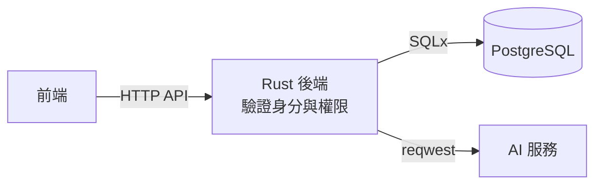

# socrates-chat

蘇格拉底式對話學習系統：學生就哲學題目與 AI 進行多輪討論。系統以追問引導學生釐清立場、檢視理由與假設，而不直接代答；教師可建立討論活動並查看學生的學習成果。系統只服務一門課程，使用資格由修課名單控制。

> **目前狀態：規格階段。** 功能需求已拆成規格（S-xx）與功能（F-xx）Issues，未定案的產品與技術決策都先由規格 Issue 處理。已確認的決策見 [`docs/specs/decisions.md`](docs/specs/decisions.md)。

## 技術棧

| 範圍 | 狀態 | 內容 |
| --- | --- | --- |
| 後端 | 已確定 | Rust、Axum、Tokio、SQLx、Serde、reqwest、tracing |
| 資料庫 | 已確定 | PostgreSQL；開發與 CI 用 Docker Compose，正式環境部署待 S-09 |
| 前端 | **暫定（S-11 尚未正式定案，隨時可改）** | React、TypeScript、Vite、Tailwind CSS、shadcn/ui、assistant-ui |
| AI 服務 | 已確定（S-03.1） | OpenAI API（後端以單一介面包裝，模型待評估） |
| 登入 | 已確定（S-01.1） | 內建電子郵件＋密碼（不開放註冊）加 Google 登入；Rust 自行實作，session 存 PostgreSQL |
| 對話傳輸 | 已確定（S-08.4） | HTTP + SSE 串流 |

各套件版本與正式環境部署方式尚未指定。Supabase 與 Redis 不在目前架構內。

### 資料流



前端只呼叫 Rust 後端，不直接存取資料庫或 AI 服務，也不持有資料庫憑證或 AI 服務金鑰。

## 專案結構

```text
.
├── backend/     # Rust + Axum API 服務
├── frontend/    # 前端（暫定技術選型，見 frontend/README.md）
├── .github/     # CI 與 commitlint workflows
├── AGENTS.md    # 給 AI coding agent 的開發指引
├── CONTRIBUTING.md
└── LICENSE      # MIT
```

## 快速開始

從 clone 到在本機跑起整個系統的完整步驟。第 1～4 步只需做一次。

### 1. 安裝工具並取得程式碼

| 工具 | 用途 |
| --- | --- |
| [Rust](https://rustup.rs/)（rustup） | 後端；版本由 `backend/rust-toolchain.toml` 指定，第一次執行 `cargo` 時自動安裝 |
| [Docker](https://docs.docker.com/get-docker/)（含 Compose） | 啟動開發用 PostgreSQL |
| Node.js 與 npm | 前端 |

```bash
git clone https://github.com/2026software-3/socrates-chat.git
cd socrates-chat
```

### 2. 啟動資料庫

```bash
docker compose up -d db    # PostgreSQL 16，監聽 127.0.0.1:5432，帳號、密碼與資料庫名稱皆為 socrates
```

### 3. 準備第三方憑證

- **Google OAuth**：到 [Google Cloud Console](https://console.cloud.google.com/apis/credentials) 建立 OAuth client（Web application），將授權的重新導向 URI 設為 `http://localhost:3000/api/auth/google/callback`（即 `${APP_BASE_URL}/api/auth/google/callback`），取得 client ID 與 secret。系統只接受 Google 登入。
- **OpenAI**：取得 API key，並決定要用的模型。具體模型尚未定案（S-03.1／S-03.4），所以 `OPENAI_MODEL` 沒有預設值，必須自行填寫。本機開發也可把 `OPENAI_BASE_URL` 指向 OpenAI 相容的服務。

### 4. 設定環境變數

```bash
cp .env.example .env    # 專案根目錄；本地執行與 Docker 共用，.env 不進版控
```

編輯 `.env`，至少填入：

| 變數 | 說明 |
| --- | --- |
| `GOOGLE_CLIENT_ID`、`GOOGLE_CLIENT_SECRET` | 第 3 步取得的 Google OAuth 憑證 |
| `ADMIN_EMAILS` | 首次登入即成為管理者的信箱，以逗號分隔 |
| `OPENAI_API_KEY`、`OPENAI_MODEL` | 第 3 步取得的 API key 與模型名稱 |

其餘變數（`DATABASE_URL`、`APP_BASE_URL`、`COOKIE_SECURE`、`RUN_MIGRATIONS` 等）的預設值適用於本機開發，說明見 `.env.example`。`RUN_MIGRATIONS=true` 時，後端啟動前會自動執行 `backend/migrations/`。

### 5. 啟動後端

後端不會自行讀取 `.env`，需先把它載入目前的終端機：

```bash
set -a && . ./.env && set +a             # 載入專案根目錄的 .env
cd backend
cargo run                                # 啟動於 http://127.0.0.1:3000
curl http://127.0.0.1:3000/health        # 另開終端機，應回傳 {"status":"ok"}
cargo test                               # 執行測試
```

### 6. 啟動前端

兩種方式擇一。

**開發模式**（熱更新）：

```bash
cd frontend
npm ci
npm run dev        # http://localhost:5173，/api 轉給 127.0.0.1:3000 的後端
```

**同網域提供**（與正式架構相同，前端與 API 共用 `http://localhost:3000`）：

```bash
cd frontend
npm ci
npm run build
```

再於 `.env` 設定 `FRONTEND_DIR=../frontend/dist`，重新載入 `.env` 並重新啟動後端，開啟 `http://localhost:3000`。

> Google 登入完成後會導回 `APP_BASE_URL`（預設 `http://localhost:3000`）。若要在開發模式的 `5173` 走完整個登入流程，需把 `APP_BASE_URL` 與 Google 的重新導向 URI 一併改成對應網址。

其他前端指令（`npm test`、`npm run typecheck`、`npm run lint`）與約束見 [`frontend/README.md`](frontend/README.md)，後端 API 見 [`docs/api/mvp-backend-api.md`](docs/api/mvp-backend-api.md)。

### 7. 第一次使用

1. 以 `ADMIN_EMAILS` 中的 Google 帳號登入，取得管理者身分。
2. 管理者新增教師帳號並維護題目庫。
3. 教師或管理者匯入修課名單（學生電子郵件）；名單外的帳號登入後看到「尚未開通」。
4. 教師建立並發布討論活動，學生即可開始對話。

### 另一種跑法：全部在容器

不想安裝 Rust 或 Node 時，只需要 Docker，使用第 4 步設定好的同一個 `.env`（不需要第 2、5、6 步）：

```bash
docker compose --profile app up --build
```

啟動後開啟 `http://localhost:3000`。這會建置單一映像（後端 API ＋ 前端建置產物，同網域提供）並連同 PostgreSQL 一起啟動，容器內的 `DATABASE_URL`、`FRONTEND_DIR`、`LISTEN_ADDR` 已自動設定，migration 也會自動執行。資料庫存放在 Docker volume（`pgdata`），`docker compose down` 不會遺失資料，加上 `-v` 才會清除。這是本機與試用的便利做法，不代表正式環境的部署方式（S-09 尚未決定）。

兩種跑法都使用 3000 埠，**同一時間只能跑其中一種**。

### 正式環境

正式環境的部署方式尚未決定（S-09）。migration 須在部署前單獨執行、不要依賴 `RUN_MIGRATIONS`，並保持 `COOKIE_SECURE=true`；維運流程見 [`docs/specs/S-09.3-ops-procedures.md`](docs/specs/S-09.3-ops-procedures.md)。

## 參與開發

請先閱讀 [CONTRIBUTING.md](CONTRIBUTING.md)。重點如下：

- 開發主線為 `main`，**禁止直接 push 到 `main`**，所有改動經由 Pull Request 合併。
- 所有 commit 遵守 [Conventional Commits](https://www.conventionalcommits.org/)，CI 會以 commitlint 檢查。
- 採 SDD + TDD：先確認規格與驗收情境，再寫會失敗的測試，最後做最小實作。

使用 AI coding agent 的開發者，請讓 agent 讀取 [AGENTS.md](AGENTS.md)。

## 授權

本專案以 [MIT License](LICENSE) 授權。所使用的開源套件皆為寬鬆授權；複製進原始碼的 shadcn/ui、assistant-ui 與打包的 Geist 字型所需的聲明見 [docs/THIRD-PARTY-NOTICES.md](docs/THIRD-PARTY-NOTICES.md)。
