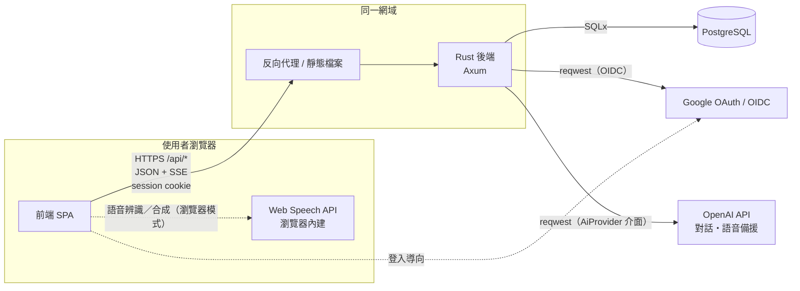
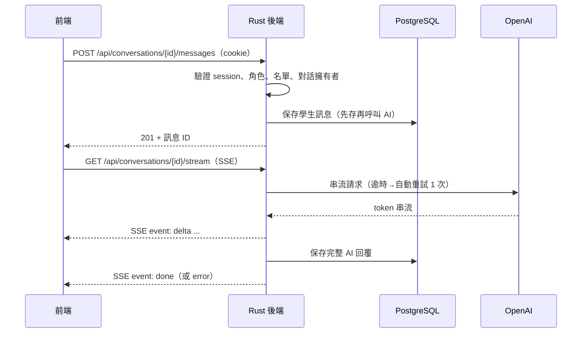

# S-08.1 元件關係圖與資料流

> **狀態：已確認（2026-09-29）。** 依據 [`decisions.md`](decisions.md) 已確認的決策撰寫。前端技術仍待 S-11，以下以「前端」泛稱。

## 1. 元件與責任

| 元件 | 負責 | 不負責 |
| --- | --- | --- |
| 前端 | 畫面、互動、等待／錯誤／空狀態；瀏覽器語音辨識與合成（S-05.3 混合模式） | 權限判斷、直接存取資料庫或 OpenAI、持有任何金鑰 |
| 反向代理 | TLS、提供前端靜態檔案、把 `/api/*` 轉給後端 | 商業邏輯 |
| Rust 後端 | 登入與 session、角色與修課名單檢查、商業規則、呼叫 OpenAI、保存所有紀錄、遮蔽敏感欄位 | 畫面呈現 |
| PostgreSQL | 使用者、session、名單、活動、對話、總結、分析結果、稽核日誌 | — |
| OpenAI | 對話生成、總結與分析、語音備援（STT／TTS） | 保存我方資料（依供應商條款） |
| Google | 身分驗證（OIDC） | 角色與權限 |

**部署建議：前端與 API 放在同一個網域**（例如 `https://example.edu/` 與 `https://example.edu/api/`）。
- session cookie 可以用 `SameSite=Lax` 的第一方 cookie，不需要處理 CORS 與跨網域 cookie。
- 前端不需要知道任何後端以外的服務位址。

## 2. 後端模組

| 模組 | 內容 | 對應 Issue |
| --- | --- | --- |
| `auth` | Google OIDC、session、`CurrentUser` extractor、角色守門 | F-01（S-08.2） |
| `roster` | 修課名單匯入、名單比對 | F-25 |
| `activities`、`questions` | 活動、題目庫 | F-02～F-04 |
| `chat` | 對話、訊息、SSE 串流、重試 | F-06～F-08 |
| `ai` | `AiProvider` trait 與 OpenAI 實作；提示／規則版本 | F-06、F-07、S-03 |
| `speech` | OpenAI STT／TTS 備援、接收瀏覽器逐字稿 | F-10 |
| `analysis` | 雷達圖、邏輯樹、標籤 | F-11～F-13、F-24 |
| `admin` | 建立與移除教師、管理介面；**所有輸出經遮蔽層** | F-01.2、S-02.2 |
| `audit` | 稽核日誌 | F-22 |

AI 呼叫一律經過 `AiProvider` trait（S-03.1「保留更換彈性」）。測試時注入假實作，不呼叫真的 OpenAI。

## 3. 主要資料流

### 3.1 文字對話（SSE）

失敗時（S-03.5）：學生訊息已保存；重試後仍失敗就送出 `event: error`，前端顯示「AI 暫時無法回覆」與重試按鈕。

### 3.2 語音（輪流模式）

- **瀏覽器模式**：前端用 Web Speech API 辨識 → 學生確認或編輯 → 以一般訊息 API 送出文字，並附 `source: "speech-browser"`。AI 回覆由瀏覽器語音合成朗讀。
- **備援模式**：前端錄音 → `POST /api/speech/transcribe`（音訊）→ 後端呼叫 OpenAI STT → 回傳文字，由學生確認後送出。AI 回覆可經 `GET /api/speech/tts?message_id=…` 取得音訊串流。
- 原始音訊**不保存**（S-05.4）：後端辨識完成或失敗後立即丟棄，不寫入資料庫、磁碟或日誌；只保存逐字稿。

### 3.3 教師與管理者檢視

- 教師：`GET /api/teacher/summaries` 只回傳 AI 總結與學生反思，**不含訊息原文**（S-02.1）。
- 管理者：所有含對話內容的欄位都經遮蔽層輸出，訊息以 `message` 取代（S-02.2）。遮蔽在後端的序列化層統一處理，不交給各 handler 自行處理。

## 4. 錯誤邊界

- 所有 API 錯誤統一為 JSON：`{"error": {"code": "ai_unavailable", "message": "AI 暫時無法回覆"}}`，不含堆疊、SQL 或金鑰。
- 每個請求產生 request ID，寫入 tracing span，並放進回應標頭 `x-request-id`，方便對照日誌。
- 外部服務錯誤（OpenAI、Google）轉換成 502 或 503 類的錯誤碼；資料庫無法連線時回 503。

## 5. 測試邊界

| 層級 | 做法 |
| --- | --- |
| Handler／API | 以 `app()` + `tower::ServiceExt::oneshot` 做整合測試（沿用目前的 `/health` 測試） |
| 資料庫 | `#[sqlx::test]` 搭配 Docker PostgreSQL，每個測試用獨立資料庫並自動套用 migrations |
| AI | `AiProvider` 注入假實作，驗證流程與錯誤處理；AI 行為品質另以 S-03.4 情境集評估 |
| Google OIDC | OIDC 驗證包在 trait 後面，測試以假身分注入；另寫少量針對 token 驗證的單元測試 |
| 遮蔽 | 以含真實樣貌內容的合成資料，驗證管理者輸出中沒有原文 |

## 6. 確認結果

1. 前端與 API 部署在同一個網域，API 走 `/api`。
2. 語音備援的 TTS 也經後端代理，前端不接觸 OpenAI。
