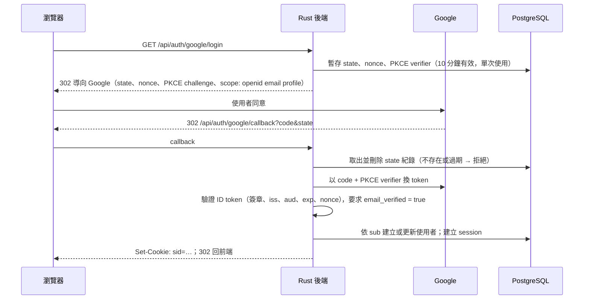

# S-08.2 登入憑證驗證與身分映射

> **狀態：已確認（2026-09-29），2026-10-04 補入內建登入。** 依據已確認的 S-01.1（內建電子郵件＋密碼與 Google 登入並存、不開放註冊、session 存 PostgreSQL）、S-01.2（以電子郵件識別，Google 另綁 `sub`）、S-01.3（管理者建立教師、`ADMIN_EMAILS`）、S-01.4（修課名單）。

## 1. 內建登入（電子郵件＋密碼）

**不開放自行註冊**：沒有註冊頁與註冊 API。內建帳號只由系統建立：

| 帳號 | 建立時機 | 初始密碼 |
| --- | --- | --- |
| 管理者 | 部署時 `ADMIN_EMAILS` 指定的信箱，首次啟動建立 | 部署時環境變數提供 |
| 教師 | 管理者新增教師時（F-01.2） | 管理者設定臨時密碼 |
| 學生 | 匯入修課名單時（S-01.4） | 尚無密碼（狀態「待設定」），由管理者設定臨時密碼後才能用內建登入；仍可直接用 Google 登入 |

- 臨時密碼只顯示一次；使用者以臨時密碼登入後，必須先更改密碼才能使用其他功能（後端以 `must_change_password` 旗標擋下其他 API，回 403 `password_change_required`）。
- 忘記密碼：不寄信，聯絡管理者重設（產生新的臨時密碼，並清除該使用者所有 session）。
- 密碼以 Argon2id 雜湊保存（`argon2` crate，實作時才加入）；長度至少 8 字元，不限制字元種類。
- `POST /api/auth/login`（email、password）：成功建立 session（同第 4 節）；失敗一律回同一個錯誤碼 `invalid_credentials`，不區分「帳號不存在」與「密碼錯誤」，帳號不存在時也做一次假的雜湊比對以避免時間差。
- 失敗限流：同一電子郵件連續失敗 5 次，鎖定 15 分鐘（鎖定期間即使密碼正確也拒絕）；鎖定狀態存 PostgreSQL。
- 密碼、臨時密碼與雜湊不得出現在日誌、API 回應與稽核日誌中。

## 2. Google 登入流程（OIDC Authorization Code + PKCE）

使用 `openidconnect` crate（底層為 reqwest），它會驗證 ID token 的簽章、`iss`、`aud`、`exp` 與 `nonce`。

- 使用者取消授權，或 Google 回傳錯誤時：導回前端登入頁並附錯誤代碼，不建立 session。
- Google 的 client secret 只存在後端的環境變數（S-08.3、S-09.2）。
- Google 登入成功後，依電子郵件找使用者：找到就綁定 `sub`（已綁定則以 `sub` 為準）；找不到就建立新使用者（沒有密碼，角色判定同第 3 節，名單外看到「尚未開通」）。

## 3. 身分映射

| 資料 | 規則 |
| --- | --- |
| 使用者識別 | 電子郵件（轉小寫後唯一）；`users.google_sub`（唯一、可為空）在 Google 登入時綁定 |
| 電子郵件 | 內建帳號以建立時的值為準；Google 登入時，已綁定 `sub` 的使用者以 Google 回傳值更新 |
| 密碼 | `users.password_hash`（可為空，表示尚未設定）、`must_change_password` |
| 顯示名稱 | 內建帳號由建立者填寫、Google 帳號取自 `name`，學生之後可自訂（雷達圖公開時顯示，S-02.3） |

**角色判定**（每次請求由 session 載入，不存在 cookie 裡）：

| 角色 | 條件 |
| --- | --- |
| 管理者 | 電子郵件在 `ADMIN_EMAILS` 中，首次登入時授予並寫入資料庫；之後由資料庫記錄為準 |
| 教師 | 電子郵件在管理者建立的教師清單中（F-01.2）；帳號已登入過時立即生效 |
| 學生 | 電子郵件在修課名單中（S-01.4） |
| 尚未開通 | 以上皆非 → 只能看「尚未開通」頁面 |

一個使用者可以同時具備多個角色，例如管理者也是教師。**教師與管理者不需要在修課名單內。**

## 4. Session

| 項目 | 建議值 |
| --- | --- |
| Token | 256 位元隨機值；資料庫只存 SHA-256 雜湊，不存原值 |
| Cookie | `sid`；`HttpOnly`、`Secure`、`SameSite=Lax`、`Path=/` |
| 有效期 | 閒置 7 天失效、絕對上限 30 天；每次使用時更新 `last_seen_at` |
| 登入時 | 一律建立新 session（防止 session fixation） |
| 登出 | 刪除該 session 紀錄並清除 cookie |
| 角色變更或名單移除 | 立即生效，因為角色是每次請求從資料庫載入 |

**CSRF 防護**：`SameSite=Lax` 加上檢查 `Origin` 標頭。所有會改變狀態的請求（POST、PUT、PATCH、DELETE），`Origin` 都必須等於本站網域，否則拒絕。

## 5. 後端授權實作

- `CurrentUser` extractor：讀 cookie → 雜湊 → 查 session 與使用者角色；找不到或過期時回 401。
- 各角色的守門以 extractor 或 middleware 表示，例如 `RequireStudent`、`RequireTeacher`、`RequireAdmin`。未通過回 403，錯誤格式依 S-08.1。
- 名單外帳號呼叫學生 API 時回 403，錯誤碼為 `not_enrolled`，前端依此顯示「尚未開通」。

## 6. Given / When / Then

- Given 帳號密碼正確，When `POST /api/auth/login`，Then 建立新 session 並設定 cookie。
- Given 電子郵件不存在或密碼錯誤，Then 兩者回應相同（`invalid_credentials`）。
- Given 同一電子郵件連續失敗 5 次，Then 鎖定 15 分鐘，期間正確密碼也被拒絕。
- Given 沒有註冊端點，When 請求 `/api/auth/register` 之類路徑，Then 回 404。
- Given 使用者以臨時密碼登入，When 呼叫其他 API，Then 回 403 `password_change_required`，更改密碼後才放行。
- Given 管理者重設某使用者的密碼，Then 該使用者所有 session 立即失效。
- Given 名單內學生尚無密碼，When 以內建登入，Then 回 `invalid_credentials`；用同信箱的 Google 登入則成功並綁定 `sub`。
- Given callback 的 `state` 不存在、已使用或過期，When 處理 callback，Then 拒絕並不建立 session。
- Given ID token 的 `aud` 不是本系統的 client ID，或簽章無效，When 驗證，Then 拒絕登入。
- Given Google 回傳 `email_verified = false`，Then 拒絕登入。
- Given 同一個 `sub` 第二次登入，Then 對應同一個使用者，並更新電子郵件。
- Given 電子郵件在 `ADMIN_EMAILS` 中的使用者首次登入，Then 成為管理者。
- Given 名單外、非教師、非管理者的使用者，When 呼叫學生 API，Then 回 403 `not_enrolled`。
- Given session 閒置超過 7 天，When 發出請求，Then 回 401。
- Given 跨站請求（`Origin` 不符）的 POST，Then 回 403。
- Given 學生被移出名單，When 下一次請求，Then 立即失去學生權限。

## 7. 確認結果

1. Session 閒置 7 天失效、絕對上限 30 天。
2. 不限制 Google 帳號的網域，由修課名單把關。
3. 教師身分由管理者建立，不提供自行申請（因此不需要申請表單）。
4. 內建登入與 Google 登入並存；不開放自行註冊；密碼由管理者重設，不寄信。

> **待確認（實作前請需求方確認）：** 密碼長度下限（8）、鎖定門檻（5 次／15 分鐘）、學生的臨時密碼發放方式（目前由管理者逐一設定；學生人數多時是否需要批次產生，尚未決定）、首位管理者初始密碼的環境變數名稱。
