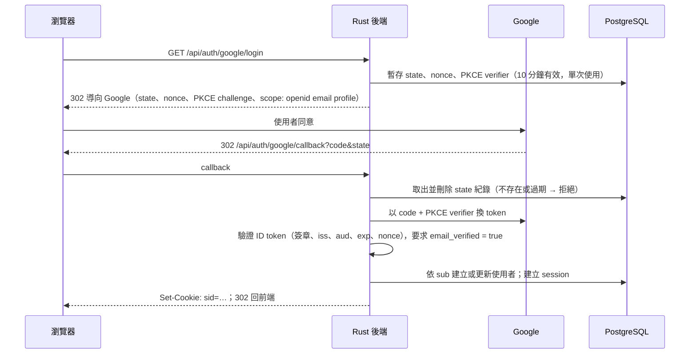

# S-08.2 登入憑證驗證與身分映射

> **狀態：已確認（2026-09-29）。** 依據已確認的 S-01.1（Rust 自行整合 Google OAuth、session 存 PostgreSQL）、S-01.2（以 Google 帳號 ID 識別）、S-01.3（管理者建立教師、`ADMIN_EMAILS`）、S-01.4（修課名單）。

## 1. 登入流程（OIDC Authorization Code + PKCE）

使用 `openidconnect` crate（底層為 reqwest），它會驗證 ID token 的簽章、`iss`、`aud`、`exp` 與 `nonce`。

- 使用者取消授權，或 Google 回傳錯誤時：導回前端登入頁並附錯誤代碼，不建立 session。
- Google 的 client secret 只存在後端的環境變數（S-08.3、S-09.2）。

## 2. 身分映射

| 資料 | 規則 |
| --- | --- |
| 使用者識別 | `users.google_sub`（唯一）；一個 Google 帳號對應一個使用者 |
| 電子郵件 | 每次登入時以 Google 回傳值更新；比對前一律轉成小寫 |
| 顯示名稱 | 取自 Google `name`，學生之後可自訂（雷達圖公開時顯示，S-02.3） |

**角色判定**（每次請求由 session 載入，不存在 cookie 裡）：

| 角色 | 條件 |
| --- | --- |
| 管理者 | 電子郵件在 `ADMIN_EMAILS` 中，首次登入時授予並寫入資料庫；之後由資料庫記錄為準 |
| 教師 | 電子郵件在管理者建立的教師清單中（F-01.2）；帳號已登入過時立即生效 |
| 學生 | 電子郵件在修課名單中（S-01.4） |
| 尚未開通 | 以上皆非 → 只能看「尚未開通」頁面 |

一個使用者可以同時具備多個角色，例如管理者也是教師。**教師與管理者不需要在修課名單內。**

## 3. Session

| 項目 | 建議值 |
| --- | --- |
| Token | 256 位元隨機值；資料庫只存 SHA-256 雜湊，不存原值 |
| Cookie | `sid`；`HttpOnly`、`Secure`、`SameSite=Lax`、`Path=/` |
| 有效期 | 閒置 7 天失效、絕對上限 30 天；每次使用時更新 `last_seen_at` |
| 登入時 | 一律建立新 session（防止 session fixation） |
| 登出 | 刪除該 session 紀錄並清除 cookie |
| 角色變更或名單移除 | 立即生效，因為角色是每次請求從資料庫載入 |

**CSRF 防護**：`SameSite=Lax` 加上檢查 `Origin` 標頭。所有會改變狀態的請求（POST、PUT、PATCH、DELETE），`Origin` 都必須等於本站網域，否則拒絕。

## 4. 後端授權實作

- `CurrentUser` extractor：讀 cookie → 雜湊 → 查 session 與使用者角色；找不到或過期時回 401。
- 各角色的守門以 extractor 或 middleware 表示，例如 `RequireStudent`、`RequireTeacher`、`RequireAdmin`。未通過回 403，錯誤格式依 S-08.1。
- 名單外帳號呼叫學生 API 時回 403，錯誤碼為 `not_enrolled`，前端依此顯示「尚未開通」。

## 5. Given / When / Then

- Given callback 的 `state` 不存在、已使用或過期，When 處理 callback，Then 拒絕並不建立 session。
- Given ID token 的 `aud` 不是本系統的 client ID，或簽章無效，When 驗證，Then 拒絕登入。
- Given Google 回傳 `email_verified = false`，Then 拒絕登入。
- Given 同一個 `sub` 第二次登入，Then 對應同一個使用者，並更新電子郵件。
- Given 電子郵件在 `ADMIN_EMAILS` 中的使用者首次登入，Then 成為管理者。
- Given 名單外、非教師、非管理者的使用者，When 呼叫學生 API，Then 回 403 `not_enrolled`。
- Given session 閒置超過 7 天，When 發出請求，Then 回 401。
- Given 跨站請求（`Origin` 不符）的 POST，Then 回 403。
- Given 學生被移出名單，When 下一次請求，Then 立即失去學生權限。

## 6. 確認結果

1. Session 閒置 7 天失效、絕對上限 30 天。
2. 不限制 Google 帳號的網域，由修課名單把關。
3. 教師身分由管理者建立，不提供自行申請（因此不需要申請表單）。
